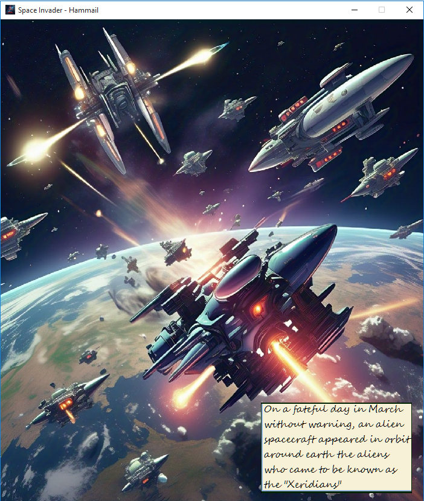
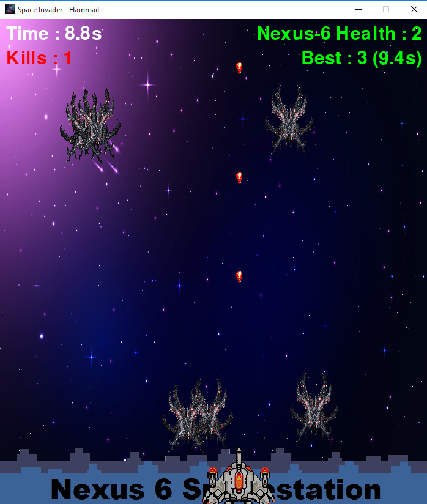
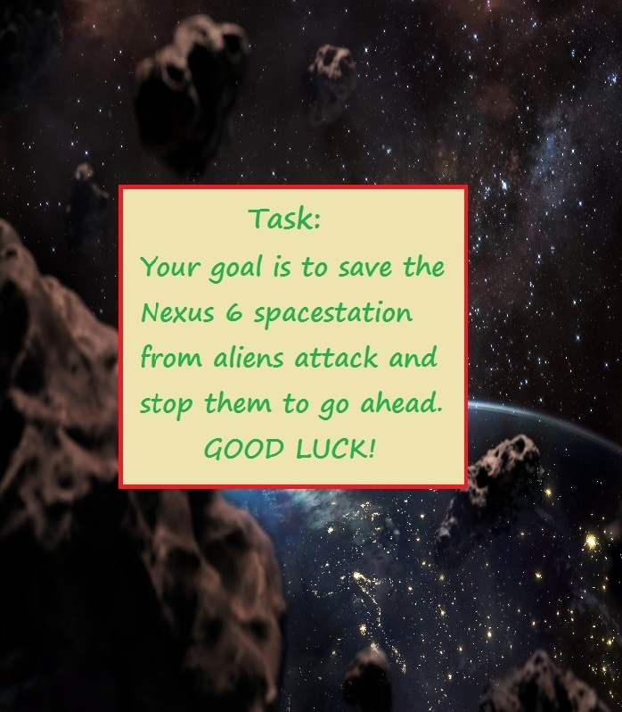
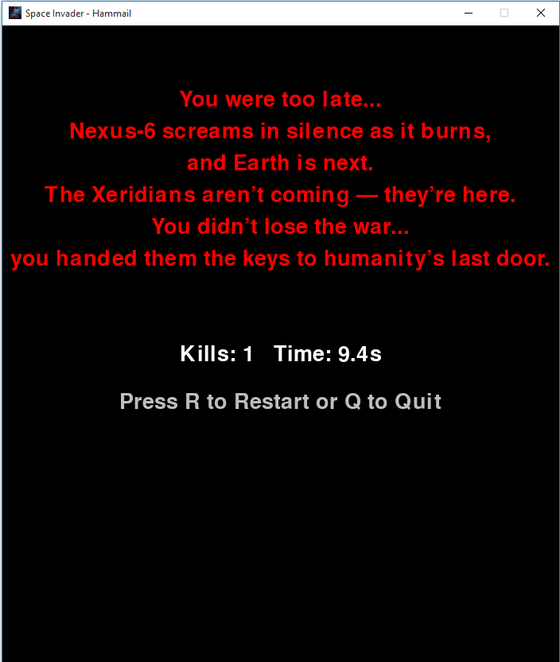

# Space Invader – Hammail

A story-driven arcade shooter set in a futuristic Earth under siege.

---

## 🌌 Game Story

In the year 2232, humanity flourished under the peaceful rule of the **Terra Union**, led by the visionary **President Astraea Lumina**. With global harmony, advanced technology, and the end of poverty and war, Earth had entered a new golden age.

But peace was short-lived.

Without warning, a mysterious alien race known as the **Xeridians** arrived, launching a devastating surprise attack on **Nexus-6** — Earth’s primary orbital station and a vital interplanetary hub. The defenses of Nexus-6 crumbled quickly, and soon Earth's major cities, including **New Eden**, fell under fire.

As the world plunged into chaos, President Lumina and global leaders struggled to respond. In the midst of panic, a last-ditch plan was born: the creation of **Arkaria** — a generation ship built to save the remnants of humanity.

Led by the fearless **Captain Hamu**, a tactician of unmatched skill, you must defend Nexus-6 and buy time for the Arkaria's launch by holding off wave after wave of Xeridian attackers.

Will you survive long enough to save humanity?

---

## 🎮 Gameplay Features

* **💥 Wave-based Combat:** Enemy attacks grow more intense with time.
* **🚀 Smooth Controls:**
    * **Arrow keys:** Move
    * **Spacebar:** Fire rockets
* **📖 Storybook Intro:** Voice-acted story scene before gameplay begins.
* **🔊 Immersive Audio:** Sound effects for firing, enemy attacks, hits, scores, and more.
* **🧠 Dynamic Difficulty:** The longer you survive, the harder the game gets.
* **📈 Score System:** Tracks player kills and time survived.
* **🏆 High Score Logic:** Best performance stored based on most kills in least time.

---

## 🛠️ How to Play

### 🖥️ Running the Game (Python)

1.  **Install Python 3.x**
2.  **Install Pygame**
    ```bash
    pip install pygame
    ```
3.  **Run the Game**
    ```bash
    python main.py
    ```

### 📦 Running the Game (EXE)

1.  Go to the `Game`  folder.
2.  Double-click the file `Space Invader - Hammail.exe` to launch the game.

No installation required — just play and enjoy!

---

## 📸 Screenshots

Visuals from the battlefield...

* **Story Scene**
    

* **Gameplay in Action**
    

* **Goal of Game**
    

* **Score Summary**
    

---

## 👑 Credits

* **Game Developer:** Hammail-Riaz
* **Story Writer:** Hammail-Riaz
* **Audio & Music:** Hammail-Riaz

“Humanity’s future rests in your hands. Suit up, Captain Hamu — it’s time to fight back.”

## 📄 License

This game, "Space Invader – Hammail," is distributed under my custom licence see [License](License.txt).

---
“Humanity’s future rests in your hands. Suit up, Captain Hamu — it’s time to fight back.”

---

## 🙏 Thanks

Thank you for checking out Space Invader – Hammail! Your support helps keep the battle going. Stay tuned for future updates and enjoy the game!
